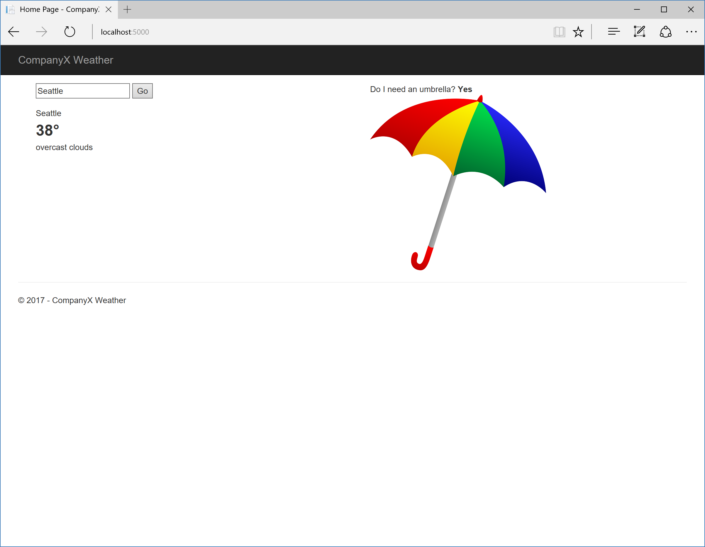
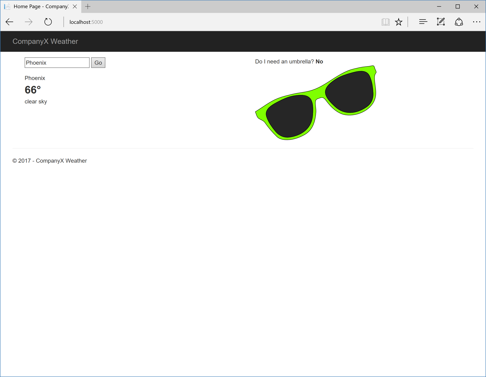

# WeatherSite

Website requirements:

1. Takes a city name as input and displays the current temperature and weather
   conditions in that city. The temperature should be displayed in Fahrenheit.
1. If it is raining, or rain is in the forecast for the next twelve hours,
   recommend the user have an umbrella.

Use [OpenWeatherMap](http://openweathermap.org/api), [Weather Underground]
(https://www.wunderground.com/weather/api), or a similar free weather service.

The page should look like this if there is rain:

and like this if there is no rain:

## .NET

See [.NET instructions](dotnet/README.md).

## React

See [React instructions](react/weather-site/README.md).

requires an npm install 
